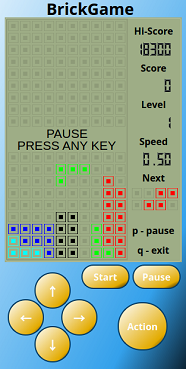
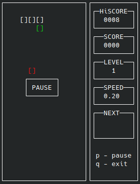

# BrickGame v2.0

В данном проекте реализованы консольный и десктопный варианты игр Тетрис и Змейка.

Проект состоит из:

1) **Backend игры Тетрис на Си**
2) **Backend игры Змейка на Си++**
3) **Контроллер для связи между backend и frontend**
4) **Консольный frontend**
5) **Десктопный frontend**

## Запуск

Для запуска необходим **Make** и **qMake**.

**Запуск**:

    make
    make run

**Документация**

    make dvi

## Управление
    Начать: enter
    Движение: стрелочки
    Действие: Space
    Пауза: p
    Выход: q
    
